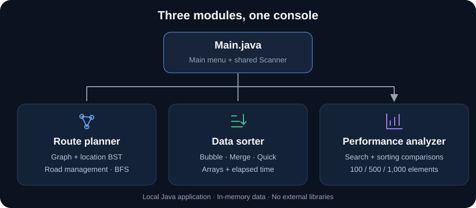
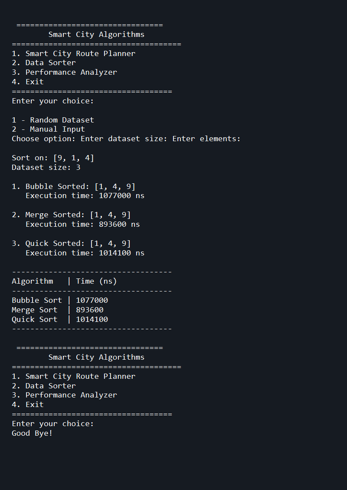

# Smart City Algorithms

A menu-driven Java console application for **CCS2300 — Data Structures and Algorithms, Assignment 1**. Explore graphs and trees, compare sorting algorithms, and observe search/sort execution times.

## Three modules

| Module | What it demonstrates |
| --- | --- |
| **Route planner** | Add/remove locations and roads; adjacency-list graph, location BST and BFS traversal |
| **Data sorter** | Bubble, Merge and Quick Sort on random or manually entered integers |
| **Performance analyzer** | Linear/Binary Search and three sorting algorithms at 100, 500 and 1,000 elements |

The route planner models an **unweighted, undirected graph**. It performs BFS traversal; it does not calculate shortest routes or travel distances.

## How it fits together



`Main.java` shares one input scanner across three independent module menus. Everything runs locally and stays in memory. [Code structure and design notes →](docs/ARCHITECTURE.md)

## Run locally

Requires **JDK 8+**. No external libraries or build framework are needed.

```sh
git clone https://github.com/4Raisan/Smart-City-Algorithms.git
cd Smart-City-Algorithms
javac -d out src/Main.java src/Module_01/*.java src/Module_02/*.java src/Module_03/*.java
java -cp out Main
```

For PowerShell commands, sample inputs and menu options, see the [usage guide](docs/USAGE.md). You can also open the project in a Java IDE and run `Main`.

## Console preview



Execution times use `System.nanoTime()` and a single run per algorithm. JVM warm-up and random inputs affect the results; these are learning demonstrations, not rigorous benchmarks. [Limits and timing notes →](docs/USAGE.md#scope-and-timing-notes)

## Team

| Student | Contribution |
| --- | --- |
| CIT-24-02-0052 — Imesh Kaushalya | Graph implementation and route management |
| CIT-24-02-0051 — Rashen Anupama | Sorting algorithms and performance comparison |
| CIT-24-02-0233 — Hasitha Lakshan | Searching algorithms, tree structure and system integration |
